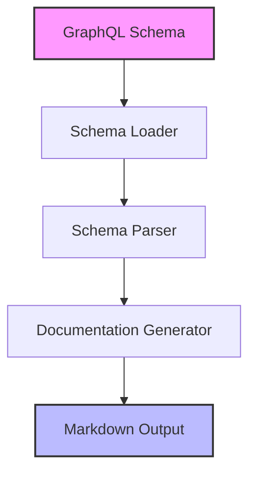

# How It Works

This page explains how GraphQL-Markdown transforms your GraphQL schema into comprehensive documentation.

## Documentation Generation Process



## The Process Step-by-Step

### 1. GraphQL Schema Input

The process begins with your GraphQL schema - this can be:

- A local `.graphql` or `.gql` file
- A remote GraphQL endpoint URL
- An introspection result JSON file
- A programmatically provided GraphQL schema object

### 2. Schema Loading

GraphQL-Markdown loads the schema using:

- For local files: Direct file reading
- For remote endpoints: Introspection query
- For provided schemas: Direct schema parsing

### 3. Schema Parsing

Once loaded, GraphQL-Markdown analyzes the schema to extract:

- Types (Object, Input, Interface, Union, etc.)
- Queries, mutations, and subscriptions
- Fields, arguments, and return types
- Descriptions and deprecation notices
- Custom directives and their usage

### 4. Documentation Generation

The parsed schema is transformed into documentation with:

- Hierarchical organization by type categories
- Cross-linking between related types
- Formatting of descriptions (Markdown support)
- Special handling for deprecated items
- Custom rendering hooks (if configured)

### 5. Markdown Output

Finally, GraphQL-Markdown outputs:

- Individual Markdown files for each type category
- Index files for easy navigation
- Table of contents and sidebar configuration
- Links and references between types

## Configuration Options

GraphQL-Markdown supports extensive configuration through the `graphql-markdown.config.js` file:

```javascript
module.exports = {
  schema: "./schema.graphql", // Schema source
  rootPath: "./docs", // Output directory
  baseURL: "graphql", // Base URL for docs
  homepage: "graphql-schema.md", // Home page
  loaders: {
    // Custom loaders
    // Loader configuration
  },
  docOptions: {
    // Documentation options
    pagination: true, // Enable pagination
    toc: true, // Table of contents
    index: true, // Generate index
    // ...more options
  },
};
```

## Example: Input to Output

**Input:** A GraphQL schema definition

```graphql
type User {
  """
  User's unique identifier
  """
  id: ID!
  """
  User's full name
  """
  name: String!
  """
  User's email address
  """
  email: String!
  """
  List of posts authored by this user
  """
  posts: [Post!]
}

type Post {
  id: ID!
  title: String!
  content: String!
  author: User!
}

type Query {
  getUser(id: ID!): User
  getPosts: [Post!]!
}
```

**Output:** Generated documentation files including:

- Schema overview (`index.md`)
- Object types (`objects.md`)
- Queries (`queries.md`)
- Cross-linked type documentation

## Customization

GraphQL-Markdown allows for customization through:

- Custom templates
- Rendering hooks
- Plugin architecture
- Integration with documentation frameworks (Docusaurus, VuePress, etc.)
- Custom loaders for specialized schema sources

By understanding this process, you can optimize your documentation setup and make the most of GraphQL-Markdown's capabilities.
